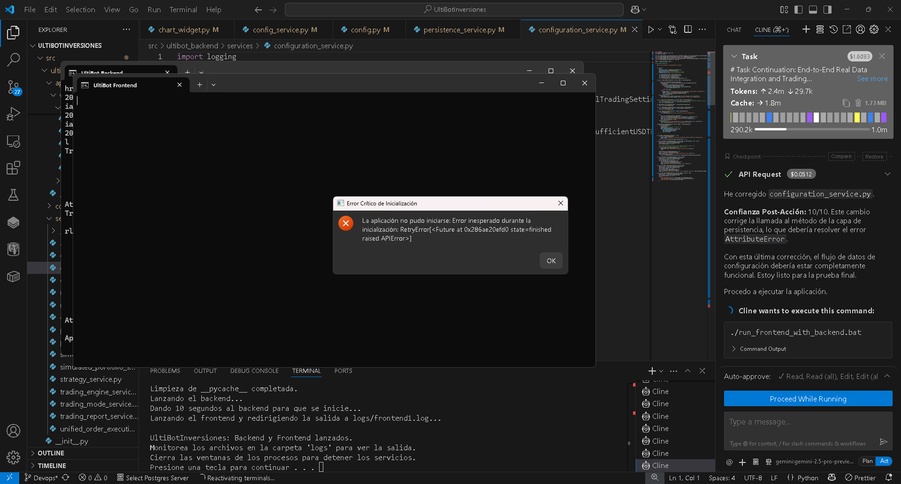
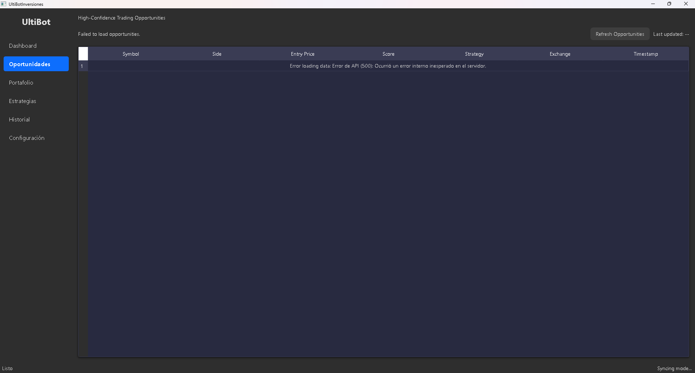
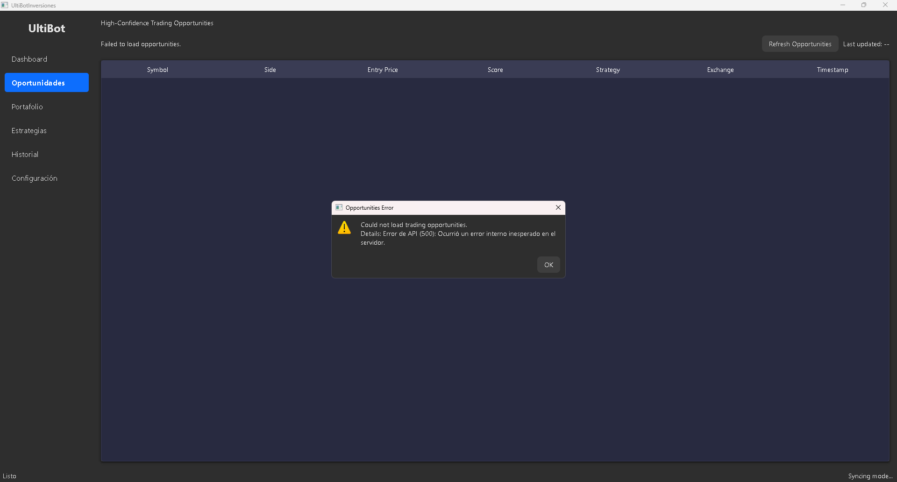

 la gráfica del "BTC/USD" es un mock, por lo tanto no me sirve, tenemos que hacer que la interfas entrega datos reales, para trades reales, BASTA con ser perezosa. Crea un post morten, y luego crea un plan amplio de acción para lograr hacer un trade aunquesea en paper trading, pero con datos reales. usa la herramienta "sequential-thinking". 