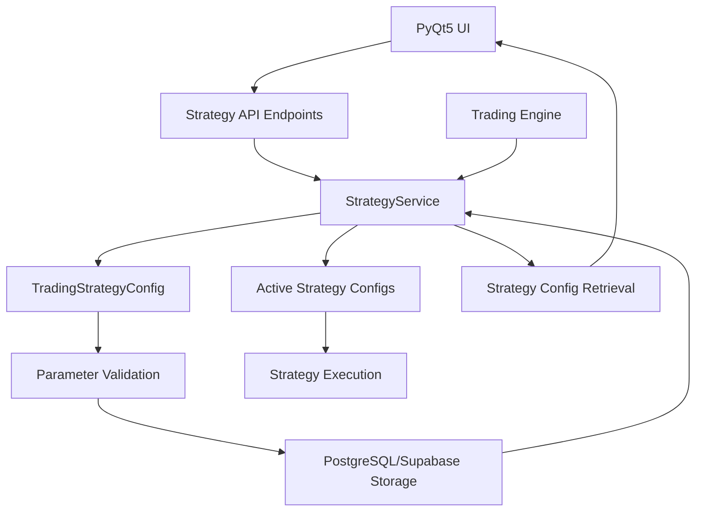

# Modular Trading Strategy System (Added in Story 5.1)

## Overview

UltiBotInversiones implements a highly modular trading strategy system that allows for easy definition, configuration, and execution of different trading strategies. The system is designed to support multiple strategy types (Scalping, Day Trading, Arbitrage, Custom AI-driven, etc.) with strategy-specific parameters while maintaining a consistent interface for management and execution.

## Key Components

### Strategy Configuration Management
- **StrategyService**: Core service responsible for CRUD operations on trading strategy configurations
- **TradingStrategyConfig**: Domain model representing a complete strategy configuration with type-specific parameters
- **BaseStrategyType**: Enumeration defining supported strategy types (SCALPING, DAY_TRADING, ARBITRAGE_SIMPLE, etc.)

### Strategy-Specific Parameter Models
Each strategy type has its own parameter model with validation:
- **ScalpingParameters**: Parameters for high-frequency, short-term trading (profit targets, stop losses, max holding time)
- **DayTradingParameters**: Technical indicator configurations (RSI, MACD periods, timeframes)
- **ArbitrageSimpleParameters**: Cross-exchange arbitrage settings (price thresholds, exchange credentials)
- **CustomAIDrivenParameters**: AI-specific configurations (prompts, context windows, decision parameters)
- **GridTradingParameters**: Grid trading configurations (price boundaries, grid levels, profit per grid)
- **DCAInvestingParameters**: Dollar cost averaging settings (investment amounts, intervals, triggers)

### API Layer
- **GET/POST/PUT/DELETE /api/v1/strategies**: RESTful endpoints for strategy management
- **PATCH /api/v1/strategies/{id}/activate**: Strategy activation for paper/real trading modes
- **PATCH /api/v1/strategies/{id}/deactivate**: Strategy deactivation
- **GET /api/v1/strategies/active/{mode}**: Retrieve active strategies by trading mode

## Extensibility Design

The system is designed for easy extension with new strategy types:

1. **Add New Strategy Type**: Define new enum value in `BaseStrategyType`
2. **Create Parameter Model**: Implement new parameter class extending appropriate base model with proper validation
3. **Update Union Type**: Add new parameter type to `StrategySpecificParameters` union
4. **Implement Validation**: Add parameter validation logic in `TradingStrategyConfig.validate_parameters_match_strategy_type`
5. **Update Service Layer**: Add parameter conversion logic in `StrategyService._convert_parameters_by_type`
6. **Database Support**: System automatically handles JSONB storage for new parameter types

## Integration Points

- **Trading Engine**: Consumes active strategy configurations to execute trading logic
- **AI Orchestrator**: Uses strategy configurations to guide analysis and decision-making
- **Portfolio Manager**: Applies strategy-specific risk parameters and position sizing
- **Data Persistence**: Stores configurations in PostgreSQL with JSONB fields for flexible parameter storage
- **UI Components**: PyQt5 interface allows users to configure and manage strategies

## Data Flow



## Strategy Lifecycle

1. **Creation**: User defines strategy via UI, parameters validated against strategy type, stored in database
2. **Configuration**: Strategy parameters can be updated, with validation ensuring consistency
3. **Activation**: Strategy marked active for paper or real trading mode independently
4. **Execution**: Trading engine retrieves active strategies and applies their logic
5. **Monitoring**: Performance metrics tracked and updated in strategy configuration
6. **Deactivation**: Strategy can be paused without losing configuration
7. **Evolution**: Strategies can be versioned and derived from parent configurations

## Security and Validation

- All strategy parameters undergo strict Pydantic validation
- Type-specific parameter validation ensures strategy consistency
- API credentials for arbitrage strategies are referenced by label, not stored directly
- Input validation prevents malicious or malformed strategy configurations
- Database constraints ensure data integrity

## Implementation Details

The strategy system follows Domain-Driven Design principles:
- **Domain Models**: Located in `src/ultibot_backend/core/domain_models/trading_strategy_models.py`
- **Business Logic**: Implemented in `src/ultibot_backend/services/strategy_service.py`
- **API Interface**: Exposed through `src/ultibot_backend/api/v1/endpoints/strategies.py`
- **Database Schema**: Stored in `trading_strategy_configs` table with JSONB parameters field

This modular design ensures that new trading strategies can be easily added without modifying existing code, promoting the Open/Closed Principle and maintainability of the system.

## How to Add New Trading Strategies

### Step-by-Step Guide

1. **Define Strategy Parameters**:
   ```python
   class NewStrategyParameters(BaseModel):
       """Parameters specific to the new strategy."""
       
       parameter1: float = Field(..., gt=0, description="Description of parameter1")
       parameter2: Optional[str] = Field(None, description="Optional parameter")
       
       @validator('parameter1')
       def validate_parameter1(cls, v):
           """Custom validation logic."""
           if v > 1.0:
               raise ValueError('parameter1 must be <= 1.0')
           return v
   ```

2. **Add Strategy Type to Enum**:
   ```python
   class BaseStrategyType(str, Enum):
       # ... existing types
       NEW_STRATEGY = "NEW_STRATEGY"
   ```

3. **Update Union Type**:
   ```python
   StrategySpecificParameters = Union[
       # ... existing types
       NewStrategyParameters,
       Dict[str, Any]  # Fallback
   ]
   ```

4. **Add Validation Logic**:
   ```python
   # In TradingStrategyConfig.validate_parameters_match_strategy_type
   expected_types = {
       # ... existing mappings
       BaseStrategyType.NEW_STRATEGY: NewStrategyParameters,
   }
   ```

5. **Update Service Layer**:
   ```python
   # In StrategyService._convert_parameters_by_type
   if strategy_type == BaseStrategyType.NEW_STRATEGY:
       return NewStrategyParameters(**parameters_data)
   ```

This systematic approach ensures that new strategies integrate seamlessly with the existing infrastructure while maintaining type safety and validation.
