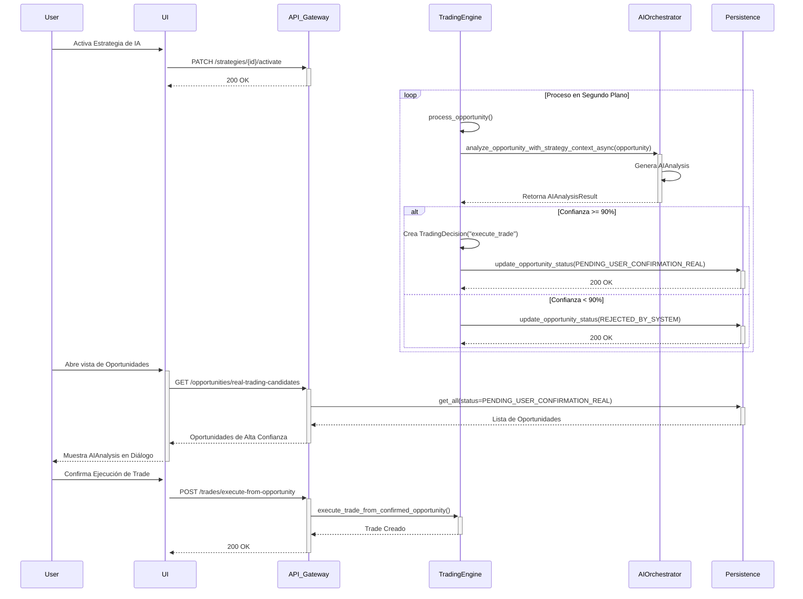

# Flujo Transaccional: Validación de Estrategia de IA

## 1. Propósito y Alcance
Este documento visualiza el ciclo de vida completo de la validación de una oportunidad de trading mediante una estrategia de IA, desde la activación de la estrategia hasta la confirmación del usuario. El objetivo es clarificar las interacciones entre los componentes clave del sistema.

## 2. Cómo Interpretar este Diagrama
- **Participantes:** Representan los componentes del sistema (UI, API, servicios de backend).
- **Flechas:** Indican el flujo de control y las llamadas entre componentes.
- **Loop:** Muestra el proceso continuo del motor de trading que busca y procesa oportunidades.
- **Alt:** Representa la bifurcación lógica clave basada en el umbral de confianza del análisis de la IA.

## 3. Diagrama

## 4. Observaciones y Análisis del Oráculo
- El flujo es asíncrono y está impulsado por un motor de trading que opera en segundo plano.
- La decisión crítica de proceder con una oportunidad de trading real depende de un umbral de confianza preconfigurado, lo que introduce un punto de control de riesgo automatizado.
- El `AIOrchestratorService` es el componente central para la inteligencia del sistema, encapsulando la lógica de análisis.
- El usuario tiene la última palabra para ejecutar operaciones de trading real, actuando como una capa final de seguridad y control.

## 5. Siguientes Pasos Sugeridos
- Implementar un sistema de monitoreo para las decisiones del `TradingEngine` para auditar por qué ciertas oportunidades son rechazadas.
- Añadir más métricas al `AIAnalysisResult` para enriquecer la información presentada al usuario.
- Considerar la implementación de un mecanismo de re-análisis para oportunidades que caen justo por debajo del umbral de confianza.
